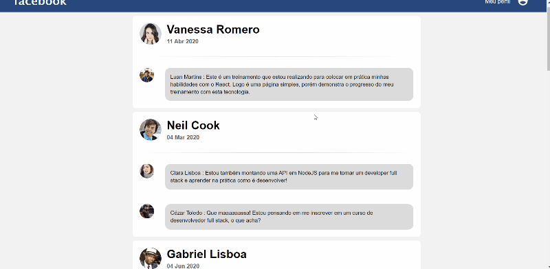

# React Simple Facebook Page



### This is a simple Facebook page that uses the basics of ReactJS, Babel and Webpack

---

# Installation

Just download it and run the next command:

```bash
yarn install
```

This will download all the dependencies

>You'll need to have [`npm`](https://www.npmjs.com/) and [`yarn`](https://yarnpkg.com/) installed on your machine. 

# Use

To show the page, run this command on terminal inside the project folder.

```bash
npm install
```
